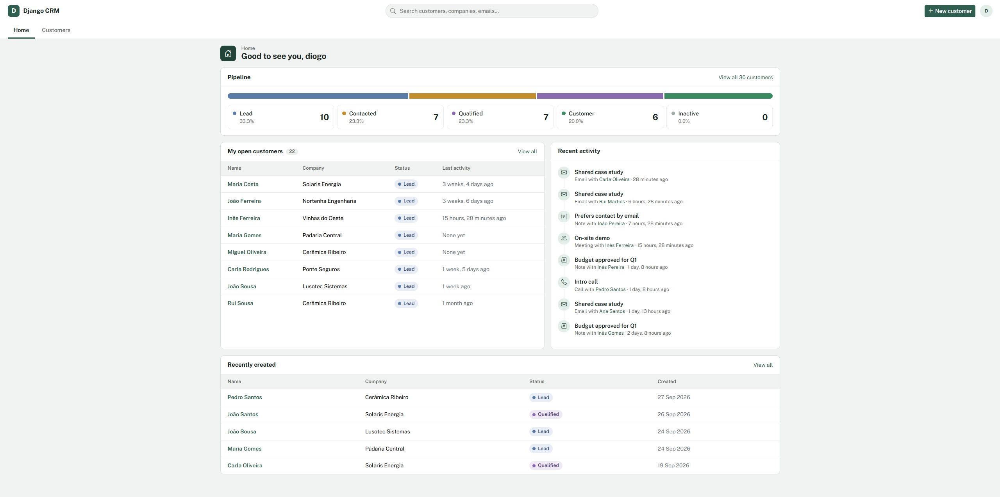
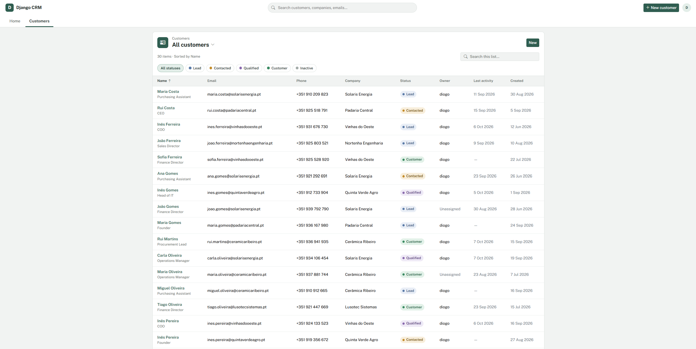
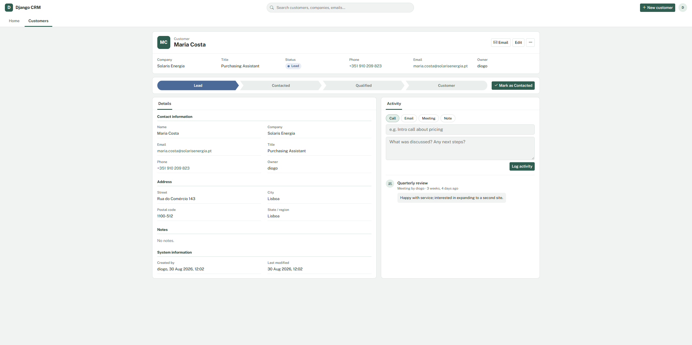
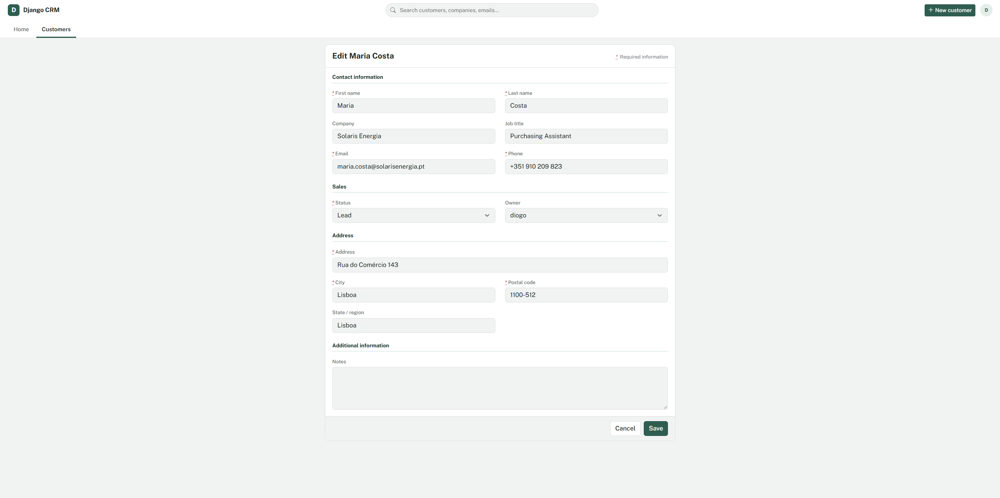
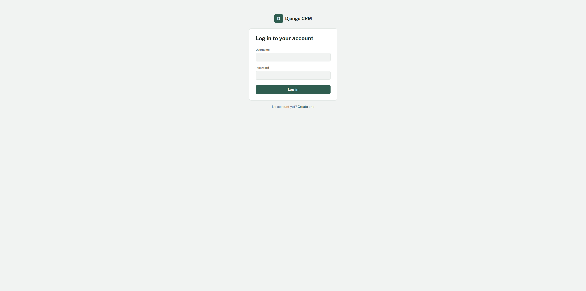

# Django CRM

A customer relationship manager built with Django. Track customers through a sales pipeline, log every call, email, and meeting, and see where everything stands from a single dashboard.



## Screenshots

| Customer list | Customer record |
| --- | --- |
|  |  |

| Edit form | Login |
| --- | --- |
|  |  |

## Features

- **Home dashboard** with a pipeline breakdown by stage, your open customers, recent activity, and recently created records
- **List view** with "All / My customers" views, status filters, search, sortable columns, and pagination
- **Record page** with a highlights panel, a clickable stage path (Lead → Contacted → Qualified → Customer), full details, and an activity timeline
- **Activity logging** for calls, emails, meetings, and notes; stage changes are logged automatically
- Customer owners, companies, and job titles
- Account registration, login, and logout
- Django admin with activity history inline on each customer
- Runs on SQLite out of the box; MySQL supported through settings
- Automated tests for the main flows

## Tech stack

Python 3.10+, Django 5.2, Bootstrap 5, Bootstrap Icons, SQLite or MySQL.

## Getting started

```bash
# 1. Clone the repository
git clone https://github.com/DiogoS7/Django-CRM.git
cd Django-CRM

# 2. Create and activate a virtual environment
python -m venv .venv
# Windows:
.venv\Scripts\activate
# macOS / Linux:
source .venv/bin/activate

# 3. Install dependencies
pip install -r requirements.txt

# 4. Create your local settings file
# Windows:
copy .env.example .env
# macOS / Linux:
cp .env.example .env

# 5. Set up the database and an admin user
python manage.py migrate
python manage.py createsuperuser

# 6. (Optional) Add 30 sample customers with activity history
python manage.py seed_customers
# or wipe existing customers first:
python manage.py seed_customers --clear

# 7. Start the server
python manage.py runserver
```

Then open http://127.0.0.1:8000.

## Configuration

Settings are read from a `.env` file in the project root. See `.env.example` for every option.

| Variable | Purpose | Default |
| --- | --- | --- |
| `DJANGO_DEBUG` | Debug mode, for local development only | `False` |
| `DJANGO_SECRET_KEY` | Secret key; required when debug is off | — |
| `DJANGO_ALLOWED_HOSTS` | Comma-separated host names | `localhost,127.0.0.1` |
| `DB_ENGINE` | `sqlite` or `mysql` | `sqlite` |
| `DB_NAME`, `DB_USER`, `DB_PASSWORD`, `DB_HOST`, `DB_PORT` | MySQL connection, used when `DB_ENGINE=mysql` | — |

### Using MySQL

1. Install the driver: `pip install mysqlclient`
2. Create the database: `CREATE DATABASE dcrm CHARACTER SET utf8mb4;`
3. Set `DB_ENGINE=mysql` and the `DB_*` values in `.env`
4. Run `python manage.py migrate`

## Running the tests

```bash
python manage.py test
```

## What I learned

This project started in 2023 as a tutorial-based CRUD app and was later rebuilt to follow production practices:

- Keeping secrets out of source control with environment variables
- Protecting destructive actions with POST requests and confirmation pages
- Modeling a sales pipeline and an activity history with Django's ORM, including annotations and conditional ordering
- Writing automated tests for access control, validation, and core workflows
- Designing a consistent interface around a small, purposeful color system

## Project structure

```
dcrm/          Project settings and root URLs
customers/     The CRM app: models, forms, views, tests
  templates/customers/
  management/commands/seed_customers.py
templates/     Shared templates (base layout, login, registration)
static/css/    App styles
docs/          Screenshots for this README
```
